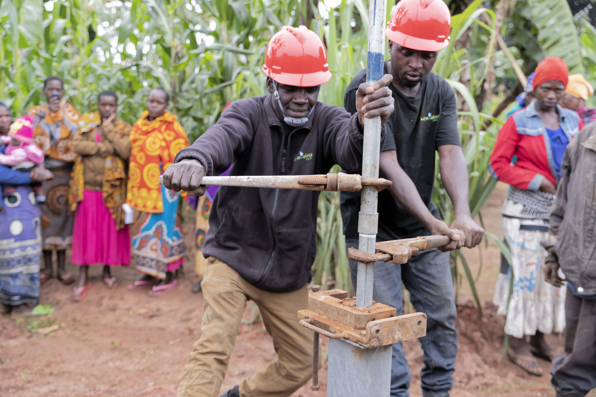
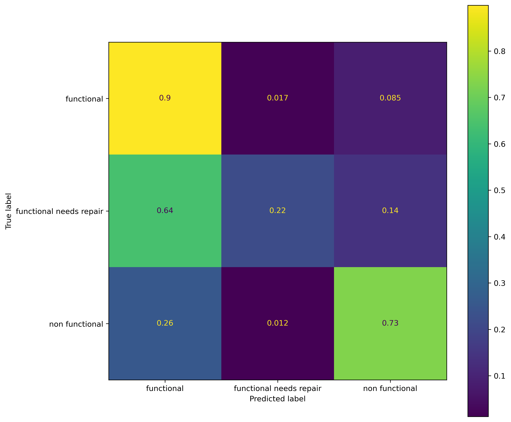

# TANZANIA WELL PUMPS PREDICTIVE ANALYSIS


Author: [TROY STEVE](https://github.com/01Troy)





### Problem:
Despite having access to enormous volumes of fresh water, many Tanzanians still experience water shortages because of inadequate infrastructure for accessing and storing it in both rural and urban regions. Only a small number of homes have access to clean, piped water for drinking. Only a small percentage of rural households have access to water for agriculture irrigation.

A combination of measures on the systems and hard infrastructure are needed to improve access to water. In both urban and rural locations, pipes, irrigation systems, and pumps must be built. Thankfully, the government and other well-wishers acted and substantially expanded public resources to the water industry. To supply water to as many homes as feasible, wells and pumps have been constructed.

The Tanzanian Ministry of Water has recruited our data science consulting organization to develop a model to help predict whether water pumps are functioning, functional but in need of repairs, or non-functional.

Our model will help reduce wastage of the Ministry's resources by only dispatching repair teams to malfunctioning or potentially in need of repair pumps. In addition to maximizing accuracy, we also want to increase recall to make sure Tanzanians have access to potable water and that few malfunctioning or damaged pumps go unnoticed.


### Data
The data at our disposal comes from Taarifa and the Tanzanian Ministry of Water. After combining our two data sets, we will have set with 59400 rows and 41 columns. Among them is our target (status_group) that has three categories making this a ternary classification problem by default.

### Methods





The data cleaning, processing and exploration was done. Later, predictive models were build.


### Results
We came up with a model that has an accuracy score of 78%. This means that it will predict correctly 78% of the times the government will be predicting the condition of the pumps.


### Limitations and Recommendations
While preparing my data, I removed many columns that had similar information. However, these variables might contain information that is important and would improve our prediction. Also while tuning the models, I used a few hyperparameters because of time and at times those that I used took a long time to load. I believe that if the models would be tuned with all the available hyperparameters, we would achieve even better results.

### Conclusion

The model we've come up with has an accuracy score of 78% meaning that the Tanzanian government will be able to predict correctly 78% of the times it wants to pump funds towards replacement of pumps that aren't functional and towards repairing of those that are functional but need repairs. This will save the government the time and resources it wwould have used to go round checking the pumps and at times investing in those wells that it shouldn't.

```bash
├── code
├── data
├── images
├── _tzdatacleaningneda.ipynb_.ipynb
├── _tzdatamodeling.ipynb.ipynb_.ipynb
├── _init_.py
├── presentation.pdf
├── README.md
 ```
