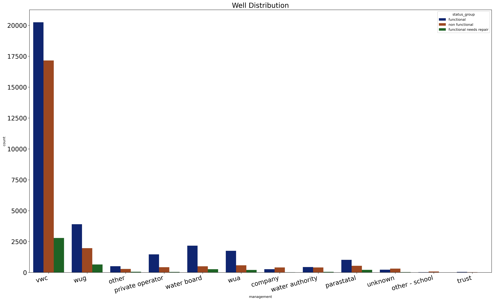

# TANZANIA WELL PUMPS PREDICTIVE ANALYSIS


Author: [TROY STEVE](https://github.com/01Troy)


### Problem:
Despite having access to enormous volumes of fresh water, many Tanzanians still experience water shortages because of inadequate infrastructure for accessing and storing it in both rural and urban regions. Only a small number of homes have access to clean, piped water for drinking. Only a small percentage of rural households have access to water for agriculture irrigation.

A combination of measures on the systems and hard infrastructure are needed to improve access to water. In both urban and rural locations, pipes, irrigation systems, and pumps must be built. Thankfully, the government and other well-wishers acted and substantially expanded public resources to the water industry. To supply water to as many homes as feasible, wells and pumps have been constructed.

The Tanzanian Ministry of Water has recruited Plex Data to develop a model to help predict whether water pumps are functioning, functional but in need of repairs, or non-functional. An Exploratory data analysis of the data will also be done to show the relationship between the target and various features.

The model will help reduce wastage of the Ministry's resources by only dispatching repair teams to malfunctioning or potentially in need of repair pumps. In addition to maximizing accuracy, the team will also want to increase recall to make sure Tanzanians have access to potable water and that few malfunctioning or damaged pumps go unnoticed.


### Data
The data at our disposal comes from Taarifa and the Tanzanian Ministry of Water. After combining our two data sets, we will have set with 59400 rows and 41 columns. Among them is our target (status_group) that has three categories making this a ternary classification problem by default.

### Methods


The data cleaning, processing and exploration was done. Later, predictive models were build.


### Results




We came up with a model that has an accuracy score of 78%. This means that it will predict correctly 78% of the times the government will be predicting the condition of the pumps.
VWC manages the most number wells in Tanzania. VWC also has the highest number of non functional pumps.

### Limitations
While preparing my data, I removed many columns that had similar information. However, these variables might contain information that is important and would improve our prediction. Also while tuning the models, I used a few hyperparameters because of time and at times those that I used took a long time to load. I believe that if the models would be tuned with all the available hyperparameters, we would achieve even better results.


### Conclusion

The model we've come up with has an accuracy score of 78% meaning that the Tanzanian government will be able to predict correctly 78% of the times it wants to pump funds towards replacement of pumps that aren't functional and towards repairing of those that are functional but need repairs. This will save the government the time and resources it wwould have used to go round checking the pumps and at times investing in those wells that it shouldn't.

 ### Recommendations
 The model that has been developed and the analysis that was done will go a long way in helping the Tanzanian government to make the necessary intervations in order to address the issue of water shortage in the country.

The government should study keenly gravity as the mode of extraction of water in the wells. This is because this mode has the highest number of non functional wells. However this mode has a high number of functional pumps. As a mode, of keen interest is motorpump. The number of non functional pumps outnumbers that of functional pumps. It's recommended that the government should stop using this mode of extraction.

VWC manages many wells in Tanzania. VWC also has the highest number of non functional pumps. The goverment should investigate why this is so. Is it because VWC is overwhelmed by the number of wells it is managing or it because it's not getting enough funds to help maintain these wells.

The government should also consider drilling more wells as majority of the wells do not have suffient water quantity. Most wells have either insufficient, dry, seasonal and unknown.

The goverment should also send experts to Mbeya, Morogoro and Shinyanga so that they can look into at the pumps in these areas as they have a high number of non functional pumps. Regular visits to this areas by officials should be done.

```bash
├── code
├── data
├── images
├── _tzdatacleaningneda.ipynb_.ipynb
├── _tzdatamodeling.ipynb.ipynb_.ipynb
├── _init_.py
├── presentation.pdf
├── README.md
 ```
